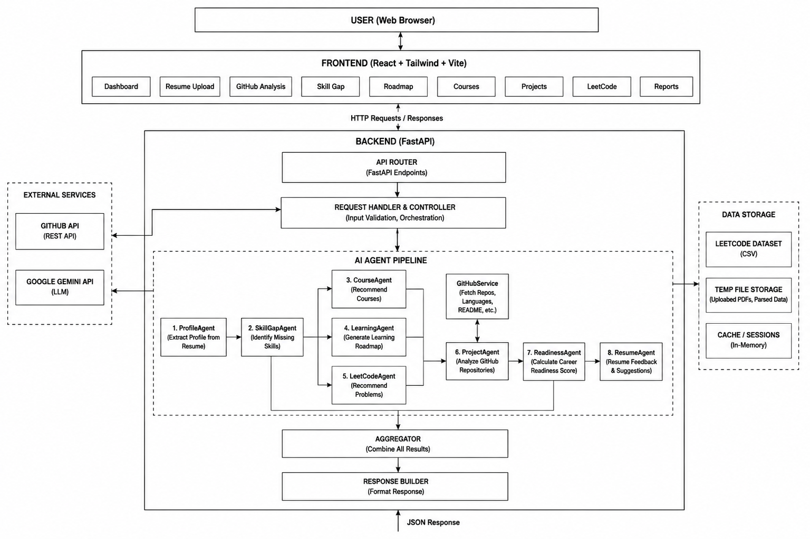
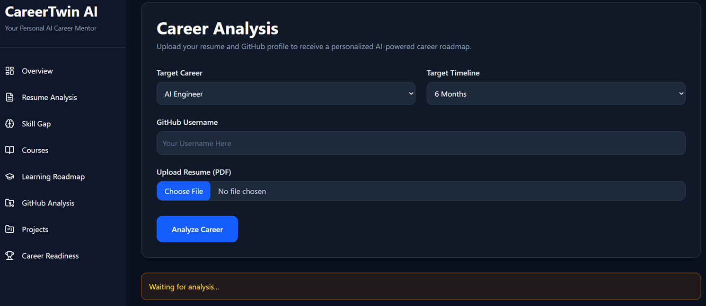
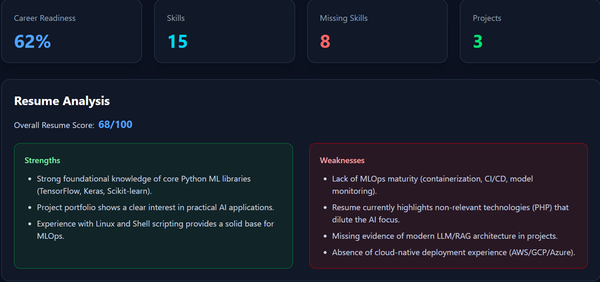
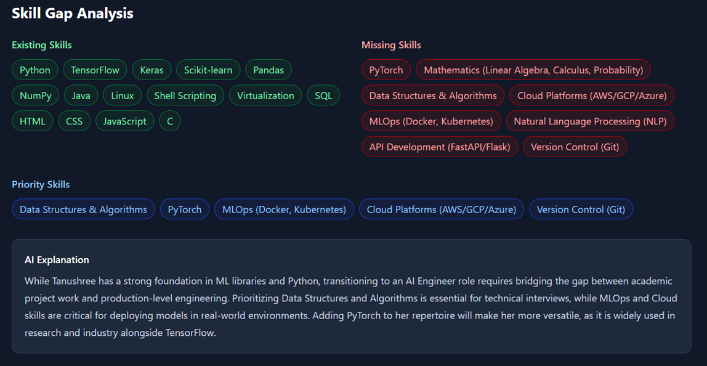
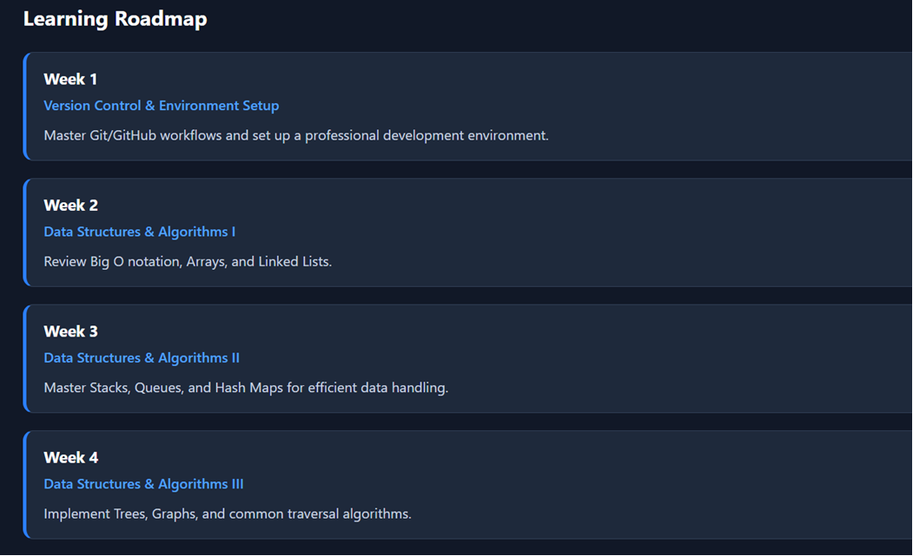
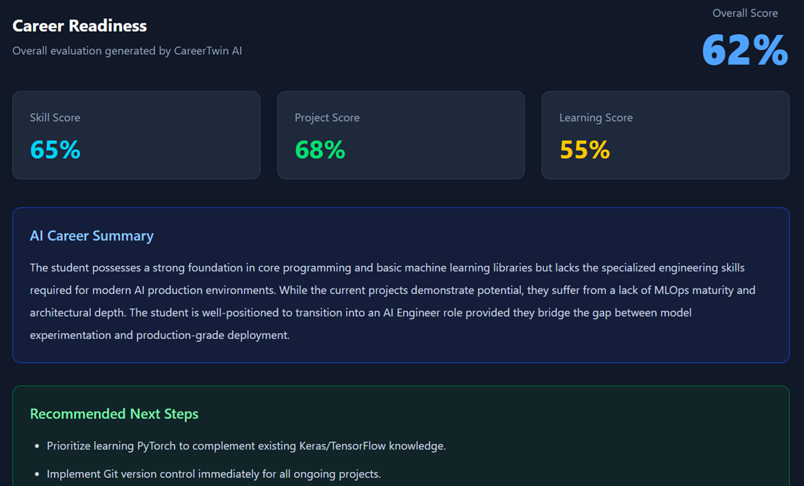
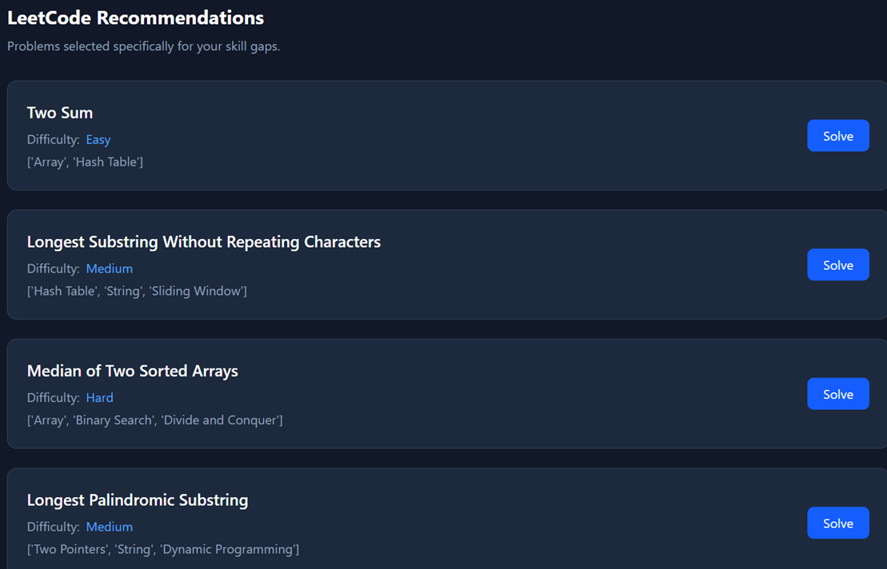

#  CareerTwin AI

An AI-powered career guidance platform that analyzes a user's resume and GitHub profile to generate personalized career insights, identify skill gaps, recommend learning resources, evaluate projects, and suggest LeetCode problems based on missing skills.

---

## Features

-  Resume Parsing using PDF upload
-  AI Profile Analysis using Google Gemini
-  GitHub Repository Analysis
-  Skill Verification from GitHub Projects
-  Skill Gap Analysis
-  Personalized Course Recommendations
-  AI Learning Roadmap
-  AI Project Evaluation
-  Career Readiness Score
-  Resume Feedback
-  Personalized LeetCode Recommendations

---

## Tech Stack

### Frontend
- React
- Vite
- Tailwind CSS

### Backend
- FastAPI
- Python

### AI
- Google Gemini API

### Services
- GitHub REST API
- PDF Processing

### Dataset
- LeetCode Problems Dataset (CSV)

## AI Agent Workflow

CareerTwin AI follows a multi-agent architecture where each agent performs a specialized task and passes its output to downstream agents.

```text
Resume PDF
      │
      ▼
ProfileAgent
      │
      ├────────────► SkillGapAgent
      │                  │
      │                  ├────────► CourseAgent
      │                  ├────────► LearningAgent
      │                  └────────► LeetCodeAgent
      │
      ├────────────► ProjectAgent
      │                  ▲
      │                  │
      │            GitHubService
      │
      ├────────────► ReadinessAgent
      │
      └────────────► ResumeAgent
```

### Agent Responsibilities

| Agent | Responsibility |
|--------|----------------|
| ProfileAgent | Extracts user profile from resume |
| SkillGapAgent | Identifies missing skills for the target career |
| CourseAgent | Recommends courses based on skill gaps |
| LearningAgent | Generates a personalized learning roadmap |
| LeetCodeAgent | Suggests coding problems mapped to missing skills |
| ProjectAgent | Evaluates GitHub repositories and projects |
| ReadinessAgent | Calculates overall career readiness score |
| ResumeAgent | Reviews resume quality and provides improvement suggestions |

## System Architecture

The application follows a client-server architecture where the React frontend communicates with a FastAPI backend. The backend orchestrates multiple AI agents, integrates with the GitHub API, processes resume PDFs, and generates personalized career insights.



## Screenshots

### Dashboard


### Resume Analysis


### GitHub Analysis


### Skill Gap Analysis


### Learning Roadmap


### Career Readiness


### LeetCode Recommendations


## Installation

### Clone the repository

```bash
git clone https://github.com/Tanushree-09/Careertwin-ai.git
cd Careertwin-ai
```

### Backend

```bash
python -m venv venv

# Windows
venv\Scripts\activate

pip install -r requirements.txt

uvicorn main:app --reload
```

### Frontend

```bash
cd frontend
npm install
npm run dev
```

Open:

```
http://localhost:5173
```

## Future Improvements

- Company-specific interview preparation
- Personalized HackerRank recommendations
- ATS resume optimization
- Authentication and user accounts
- Resume version comparison
- Job recommendation integration